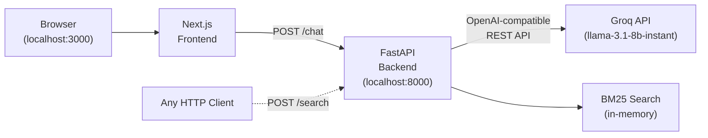
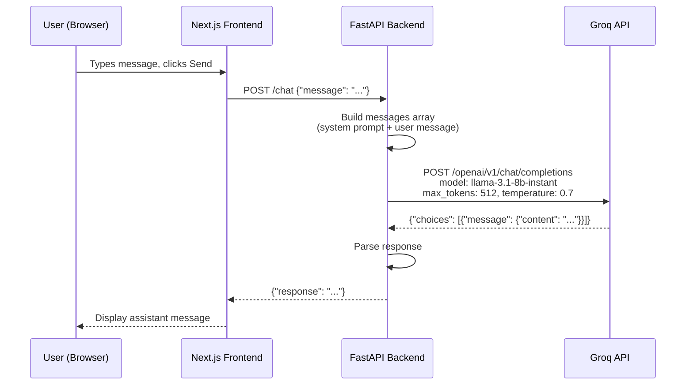
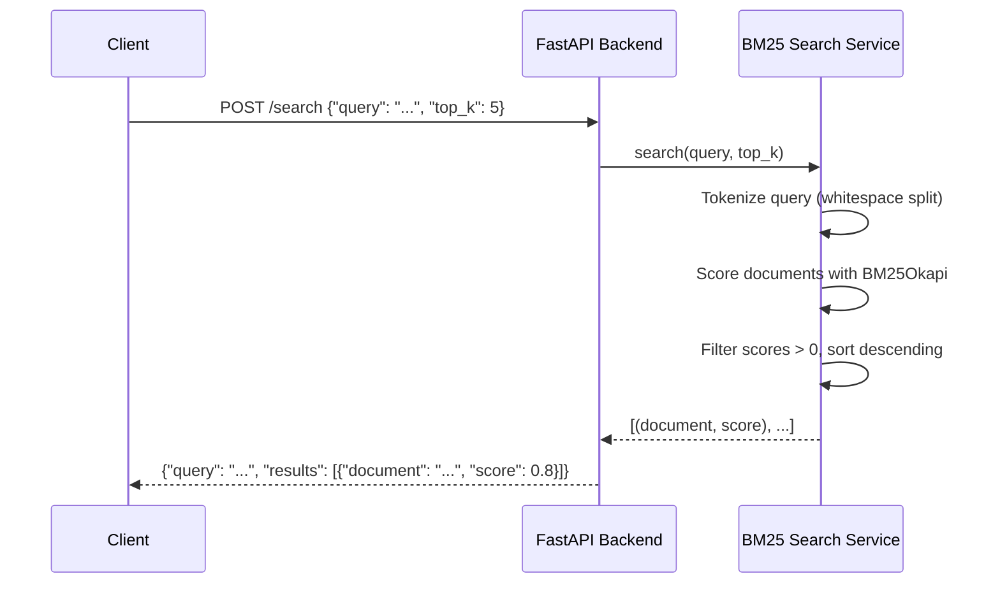

# Architecture

This document describes the system architecture of Python Jarvis, including component responsibilities, request flows, and key design decisions.

## System Overview

Python Jarvis is a two-tier application: a Next.js frontend that communicates over HTTP with a FastAPI backend. The backend integrates with the Groq cloud API for LLM inference and provides an in-memory BM25 search engine for document retrieval.

> The frontend currently only uses `POST /chat`. The `POST /search` endpoint is available but not yet integrated into the UI.

## Request Flows

### Chat Flow (`POST /chat`)

### Search Flow (`POST /search`)

## Component Responsibilities

| Component | Location | Responsibility |
| --------- | -------- | -------------- |
| **FastAPI App** | `backend/app/main.py` | App initialization, CORS middleware, router mounting |
| **API Routes** | `backend/app/api/routes.py` | Request handling for `/chat`, `/search`, `/health` |
| **LLM Service** | `backend/app/services/llm_service.py` | Groq API communication via httpx |
| **Document Service** | `backend/app/services/document_service.py` | BM25-based document indexing and search |
| **Schemas** | `backend/app/models/schemas.py` | Pydantic request/response validation |
| **Config** | `backend/app/utils/config.py` | Environment variable loading |
| **Chat UI** | `frontend/src/components/Chat.tsx` | Message display, user input, API calls |
| **Pages** | `frontend/src/pages/` | Next.js page routing (single page) |

## Design Notes

- **Groq as LLM provider** — The integration uses the OpenAI-compatible chat completions format (`/openai/v1/chat/completions`), so swapping to another OpenAI-compatible provider would require only a URL and key change.
- **BM25 for search** — `rank-bm25` (BM25Okapi) provides keyword-based ranking with no external infrastructure. Documents are tokenized via whitespace split — no stemming or NLP pipeline.
- **No database** — Documents live in-memory and reset on restart. This keeps the setup to a single dependency (Groq API key).
- **Separate frontend and backend** — FastAPI provides auto-generated OpenAPI docs and Pydantic validation. Next.js provides file-based routing and a React development experience. All current endpoints are synchronous (`def`, not `async def`).

## See Also

- [API Reference](api-reference.md) — Detailed endpoint specifications
- [Backend Guide](backend.md) — Deep dive into backend services
- [Frontend Guide](frontend.md) — Frontend component architecture
- [Configuration](configuration.md) — All configuration options
