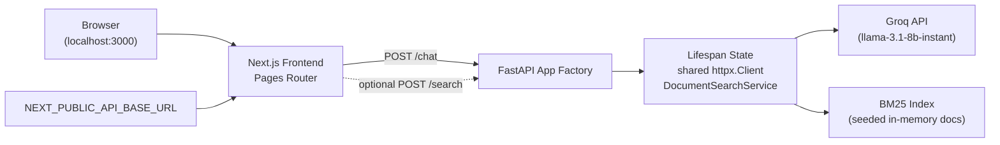

# Architecture

Python Jarvis is a two-tier application: a Next.js Pages Router frontend talks to a FastAPI backend over HTTP. The backend owns chat orchestration and BM25 search; the frontend owns UI state, config checks, and request display.

## System Overview

## Request Flow

### Chat

1. `Chat.tsx` loads `getApiConfig()` from `frontend/src/lib/config.ts`.
2. `sendChatMessage()` in `frontend/src/lib/api.ts` sends `POST /chat` to `NEXT_PUBLIC_API_BASE_URL`.
3. FastAPI routes read the shared `httpx.Client` from `request.app.state.http_client`.
4. `llm_service.py` calls Groq and raises typed exceptions on timeout, upstream HTTP errors, invalid payloads, or missing local config.
5. App-level exception handlers in `backend/app/main.py` map those exceptions to `500`, `502`, or `504`.

### Search

1. FastAPI lifespan seeds `DocumentSearchService` once at startup.
2. Routes read `request.app.state.search_service`.
3. `DocumentSearchService.search()` tokenizes query text with `split()`, scores via BM25, and returns positive matches sorted by score.

## Component Responsibilities

| Component | Location | Responsibility |
| --- | --- | --- |
| FastAPI app factory | `backend/app/main.py` | Builds the app, registers lifespan resources, CORS, router, and exception handlers |
| API routes | `backend/app/api/routes.py` | Validate requests and delegate to state-managed services |
| Exceptions | `backend/app/exceptions.py` | Typed errors for chat service failure modes |
| LLM service | `backend/app/services/llm_service.py` | Groq request construction, parsing, and error translation |
| Search service | `backend/app/services/document_service.py` | Seeded BM25 indexing and lookup |
| Config helper | `backend/app/utils/config.py` | Lazy `GROQ_API_KEY` access |
| Chat container | `frontend/src/components/Chat.tsx` | Orchestrates config, loading state, and message updates |
| Presentational UI | `frontend/src/components/Composer.tsx`, `frontend/src/components/MessageList.tsx` | Input form and message rendering |
| Frontend boundary | `frontend/src/lib/config.ts`, `frontend/src/lib/api.ts` | Env validation and backend fetch logic |

## Design Notes

- Endpoints remain synchronous `def` handlers. This phase optimizes correctness and service ownership, not async migration.
- The backend still seeds five sample documents at startup; persistence and ingestion are intentionally out of scope.
- The frontend requires explicit backend configuration instead of silently assuming a localhost port.
